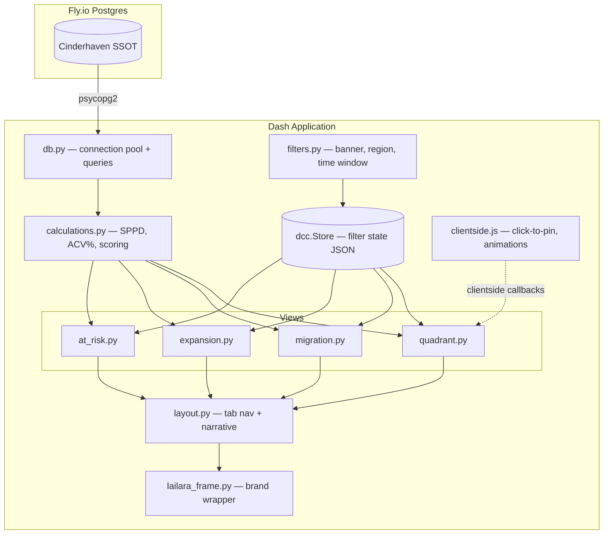
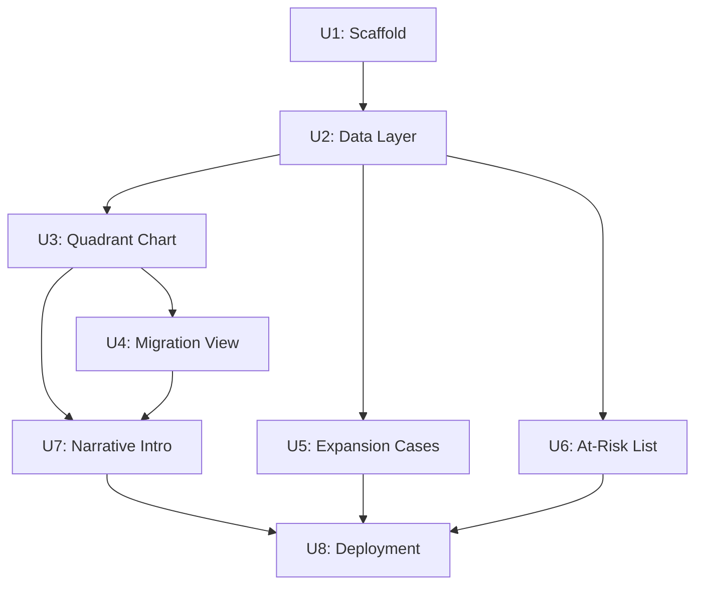

# feat: Penetration × Velocity Quadrant Dashboard

## Summary

A Dash 3.x + Plotly 6.0 application matching doormath's established stack, querying the Cinderhaven SSOT directly via psycopg2. Four interactive views (quadrant chart, migration, expansion cases, at-risk list) built as separate Dash view modules with shared filter state via `dcc.Store`. Clientside JavaScript callbacks handle opacity dimming and animations for sub-200ms response; detail card rendering uses a server-side callback triggered by dcc.Store state. A static narrative intro walks 5 protagonist SKUs through the quadrant framework before handing off to the interactive section. Deployed to Fly.io with the same Docker + Gunicorn pattern as doormath, with `min_machines_running=1` to eliminate cold starts for portfolio visitors.

---

## Problem Frame

Total sales hide whether growth comes from being in more stores or selling faster in existing ones. Two items can post identical dollars — one in 90% of doors barely moving, the other in 25% flying off the shelf — yet they need opposite strategies. This is the chart buyers use against suppliers; a brand that walks in with its own quadrant analysis controls the conversation. (See origin: `docs/brainstorms/2026-06-15-spinrate-quadrant-requirements.md`)

---

## Requirements

- R1. Narrative intro with 5 protagonist SKUs in business language
- R2. Protagonist SKUs include one per quadrant archetype + a migration story
- R3. Narrative uses migration view default viz for the migration protagonist
- R4. Quadrant chart: x=ACV%, y=SPPD, bubble size=total dollars
- R5. Quadrant dividing lines labeled: stars, hidden gems, wide but dead, question marks
- R6. Raw SPPD default; indexed toggle (item SPPD / category median) with dividing line at 1.0
- R7. Low-door-count items visually flagged, never hidden
- R8. Filters: banner/retailer, region, time window
- R9. SKU detail must be easy to see and understand without a magnifying glass or multiple navigations
- R10. SPPD formula explicitly defined and visible in the tool
- R11. Migration view shows quadrant movement between periods
- R12. Three period modes: QoQ (default), user-selectable, rolling 13-week; behind customize toggle
- R13. Multiple viz modes: arrow overlay (default), side-by-side, migration matrix/sankey
- R14. Expansion case list ranks hidden gems by dollarized upside
- R15. Three benchmark projections per SKU (median, 75th percentile, category leader) with per-SKU guidance
- R16. Items below minimum distribution threshold excluded from expansion list
- R17. At-risk scoring: level (velocity vs category median) × trend (velocity direction over trailing periods)
- R18. Three urgency tiers: act now, fix or rationalize, watchlist
- R19. Each item surfaces which signal fires (level, trend, or both)
- R20. Watchlist tier appears separately from main at-risk tiers
- R21. All data from Cinderhaven SSOT (Postgres, dbt mart layer)
- R22. Key tables: fct_scan_data, fct_distribution, dim_stores, dim_category_benchmarks
- R23. Deployed to lailarallc.com subdomain
- R24. Follows Lailara design system

**Origin actors:** A1 (Portfolio visitor — C-suite), A2 (Cinderhaven SSOT)
**Origin flows:** F1 (First visit — guided narrative into interactive), F2 (Free exploration — filter, inspect, navigate views)
**Origin acceptance examples:** AE1 (R7, R16 — low-door SKU flagged on chart, excluded from expansion list), AE2 (R17-R19 — below-median declining SKU in act-now tier), AE3 (R17-R18, R20 — above-median declining SKU in watchlist), AE4 (R6 — indexed SPPD toggle rescales axis and dividing line), AE5 (R15 — three benchmark projections with per-SKU guidance)

---

## Scope Boundaries

- No bring-your-own-data or CSV upload — portfolio demo on Cinderhaven data
- No blog post or pillar content piece — in-tool narrative is v1; external content is separate
- No tool-to-tool pipeline — spinrate queries the SSOT independently
- No print or PDF export — spinrate is interactive-first; doormath covers the print pattern
- No cross-product-line category comparison — indexed toggle compares within a category

### Deferred to Follow-Up Work

- Print stylesheet and PDF export: separate PR if demand surfaces
- Real-time data refresh / WebSocket push: not needed for a demo with stable synthetic data
- Accessibility audit (WCAG AA): follow-up pass after core views ship

---

## Context & Research

### Relevant Code and Patterns

- **doormath-sales-penetration** (sibling tool #1): Dash 3.x + Plotly 6.0 architecture. Key files to adapt: `app/constants.py` (design tokens), `app/charts.py` (economist_layout + CHART_CONFIG), `app/lailara_frame.py` (brand frame wrapper), `app/components.py` (dark_callout_card), `app/filters.py` (filter bar + dcc.Store state). Entry point pattern: `wsgi.py` → `app/app.py` (avoids the `app.py` vs `app/` Python import collision).
- **the-question-engine**: Demonstrates direct Postgres connection to Cinderhaven SSOT via SQLAlchemy. Connection module at `db/connection.py` with `DATABASE_URL` environment variable.
- **cinderhaven-store-universe** package (in doormath): Defines the Cinderhaven data model — 50 SKUs across 5 product lines, 640 stores across 6 retailers, A/B/C volume tiers. Spinrate queries the same universe from the SSOT rather than generating in-memory.
- **Lailara design system**: Colors, typography, chart rules, interaction patterns at `LAILARA_DESIGN_SYSTEM.md`. Click-to-pin interaction (not hover), 200ms opacity transitions, 250ms number animations, dark callout cards for detail display.

### External References

- Dash clientside callbacks documentation for sub-200ms client-side interactions
- Plotly `go.Sankey` for migration matrix/sankey visualization mode
- psycopg2-binary for Postgres connection (standard for Python Dash on Fly.io)

---

## Key Technical Decisions

- **Dash + Plotly (matching doormath)**: Suite consistency and solo-dev productivity outweigh React's native client-side interaction quality. Clientside JS callbacks bridge the click-to-pin gap. If interaction quality later proves insufficient, migration path is: keep Dash as API server, build React/Visx frontend that fetches from Dash endpoints. (See origin: Key Decisions — smart defaults over option overload)
- **ACV% as default x-axis**: Weighted distribution by store volume tier (A=3, B=2, C=1) is the metric buyers actually use in line reviews. More meaningful for a C-suite audience than raw door %. Door % remains available but secondary.
- **Direct Postgres via psycopg2**: Spinrate queries the Cinderhaven SSOT directly. No intermediate API layer or ORM — raw parameterized SQL for transparency and performance. Connection pooling via psycopg2's built-in pool. (Question-engine uses SQLAlchemy for ORM; spinrate opts for psycopg2 directly since all queries are hand-written SQL.)
- **Clientside JavaScript for interactions**: Click-to-pin, opacity dimming (200ms), and number animations (250ms) run client-side via Dash clientside callbacks. Avoids server round-trips for the most latency-sensitive interactions. Approximately 50-80 lines of JS in `assets/clientside.js`.
- **Large, readable detail cards (R9 emphasis)**: Detail cards render at minimum 320px wide with 16px+ body text, high-contrast backgrounds (dark callout card pattern), and show all key metrics (SKU name, SPPD, ACV%, total dollars, door count, quadrant label, trend indicator) in a single view. No secondary clicks, no popover chains, no tooltip-sized text.
- **Module-level query caching**: Data loaded once per session (or per filter change), cached in memory. Synthetic SSOT data is stable, so aggressive caching is safe. Pattern matches doormath's module-level caching.
- **4 quarters trailing for velocity trend**: At-risk scoring uses the most recent 4 quarters to determine velocity direction. Matches business review cadence. Long enough to detect real trends, short enough to surface recent deterioration.
- **min_machines_running=1 on Fly.io**: Portfolio piece — no cold starts for C-suite visitors. Cost: ~$2-5/month on shared-cpu-1x. Worth it for sub-3-second first paint.

---

## Open Questions

### Resolved During Planning

- **X-axis default (R4):** ACV% — confirmed by user. Weighted by volume tier, standard in buyer-facing analytics.
- **Stack selection (R23):** Dash 3.x + Plotly 6.0 — confirmed. Matches doormath, reuses patterns, fastest path to production.
- **Trailing periods for at-risk trend (R17):** 4 quarters — matches quarterly business rhythm, sufficient history for trend detection.
- **Migration view default (R12):** QoQ + arrow overlay — stated in origin requirements as the smart default.

### Deferred to Implementation

- **Minimum distribution threshold for expansion list (R16):** Starting proposal is 10 stores (~1.5% of universe). Must be calibrated against actual Cinderhaven data distribution — AE1 specifies 3 stores should be excluded, so threshold must be > 3.
- **Protagonist SKU selection (R2):** Verify which Cinderhaven SKUs naturally fall into each quadrant archetype. If the data lacks clear protagonist items, seed them via dbt or direct SQL insert. Specific SKU IDs selected during implementation.
- **Quadrant dividing line positions:** Median ACV% and median SPPD across the dataset. Computed dynamically from filtered data, but edge cases (all items in one quadrant) may need a floor/ceiling.
- **Detail card layout specifics:** Exact card dimensions, field ordering, and responsive breakpoints finalized during implementation. Constraint: minimum 320px wide, 16px+ body text, all key metrics visible without scrolling.

---

## Output Structure

```
spinrate-sales-penetration/
├── wsgi.py                          # Gunicorn entry point
├── pyproject.toml                   # Dependencies + tool config
├── Dockerfile                       # Python 3.11-slim + psycopg2
├── fly.toml                         # Fly.io deployment config
├── .env.example                     # DATABASE_URL template
├── app/
│   ├── __init__.py
│   ├── app.py                       # Dash application factory
│   ├── layout.py                    # Tab navigation + view assembly
│   ├── filters.py                   # Filter dropdowns + dcc.Store state
│   ├── constants.py                 # Design tokens (from Lailara system)
│   ├── charts.py                    # economist_layout() + CHART_CONFIG
│   ├── components.py                # Reusable: detail_card(), annotation_callout()
│   ├── lailara_frame.py             # Brand frame wrapper
│   ├── db.py                        # Postgres connection + query functions
│   ├── calculations.py              # SPPD, ACV%, scoring, benchmarks
│   └── views/
│       ├── __init__.py
│       ├── quadrant.py              # Bubble scatter + click-to-pin
│       ├── migration.py             # Arrow overlay, side-by-side, sankey
│       ├── expansion.py             # Ranked hidden gems + projections
│       └── at_risk.py               # Three-tier at-risk list
├── assets/
│   ├── lailara-frame.css            # Shared brand frame kit
│   ├── style.css                    # Project-specific overrides
│   ├── clientside.js                # Click-to-pin + animation callbacks
│   └── fonts/
│       ├── playfair-display-*.woff2
│       └── source-sans-3-*.woff2
└── tests/
    ├── conftest.py                  # Shared fixtures (mock DB, sample data)
    ├── test_calculations.py
    ├── test_quadrant.py
    ├── test_migration.py
    ├── test_expansion.py
    └── test_at_risk.py
```

---

## High-Level Technical Design

> *This illustrates the intended approach and is directional guidance for review, not implementation specification. The implementing agent should treat it as context, not code to reproduce.*



**Data flow:** Postgres → `db.py` (parameterized SQL, connection pool) → `calculations.py` (SPPD, ACV%, benchmark projections, at-risk scores) → view modules (Plotly figures + Dash HTML) → `layout.py` (tab navigation, narrative section) → `lailara_frame.py` (brand header/footer). Filter state stored in `dcc.Store` (JSON) and passed to views on change. Click-to-pin interactions handled entirely client-side via `assets/clientside.js`.

---

## Implementation Units



### U1. Project Scaffold and Shared Infrastructure

**Goal:** Establish the Dash application shell with design system integration, filter components, and the Fly.io deployment configuration. Everything needed to show an empty branded page with working tab navigation.

**Requirements:** R23, R24

**Dependencies:** None

**Files:**
- Create: `wsgi.py`, `pyproject.toml`, `Dockerfile`, `fly.toml`, `.env.example`
- Create: `app/__init__.py`, `app/app.py`, `app/layout.py`, `app/filters.py`
- Create: `app/constants.py`, `app/charts.py`, `app/components.py`, `app/lailara_frame.py`
- Create: `assets/lailara-frame.css`, `assets/style.css`, `assets/clientside.js`
- Create: `assets/fonts/` (self-hosted Playfair Display + Source Sans 3 woff2 files)

**Approach:**
- Adapt doormath's scaffold: `wsgi.py` entry point (not `app.py`), `app/app.py` as Dash factory with `suppress_callback_exceptions=True`
- Port `constants.py` with all Lailara design tokens (London, Chicago, Hong Kong, Singapore, Tokyo, New York palettes + semantic status colors)
- Port `charts.py` with `economist_layout()` and `CHART_CONFIG` (displayModeBar=False, responsive=True)
- Port `lailara_frame.py` with `wrap()` function — brand header linking lailarallc.com + standard footer
- Port `lailara-frame.css` with CSS custom properties for all color tokens
- Build filter bar with dropdowns for retailer, region, and time window; state stored in `dcc.Store` for cross-view access
- Tab navigation with 4 tabs: Quadrant, Migration, Expansion Cases, At-Risk
- Docker setup: Python 3.11-slim base, psycopg2-binary, gunicorn
- Fly.io config: `primary_region = "iad"`, `min_machines_running = 1`, `internal_port = 8050`
- Self-host fonts: download woff2 files, serve from `assets/fonts/`

**Patterns to follow:**
- doormath `wsgi.py` → `app/app.py` import pattern (avoids module name collision)
- doormath `filters.py` dcc.Store JSON serialization pattern
- doormath `lailara_frame.py` wrap() function signature
- doormath `fly.toml` and `Dockerfile` structure

**Test expectation:** none — scaffolding only. Verification is visual (branded page renders with tabs and filter bar).

**Verification:**
- `python wsgi.py` starts without errors
- Browser shows branded page with Lailara header/footer, Playfair Display headings, Source Sans 3 body text
- Four tabs render (content empty), filter dropdowns appear
- No Plotly modebar, no default Dash styling bleeding through

---

### U2. Data Layer — Postgres Connection, SPPD, ACV%, and Calculations

**Goal:** Connect to the Cinderhaven SSOT and implement all metric calculations: SPPD, ACV%, indexed SPPD, door counts, distribution metrics, velocity trends, and benchmark projections. Verify or seed protagonist items.

**Requirements:** R4, R6, R10, R17, R21, R22

**Dependencies:** U1

**Files:**
- Create: `app/db.py`
- Create: `app/calculations.py`
- Create: `tests/conftest.py`, `tests/test_calculations.py`

**Approach:**
- `db.py`: psycopg2 connection pool using `DATABASE_URL` from environment. Parameterized SQL queries (no ORM). Functions: `get_scan_data(filters)`, `get_distribution(filters)`, `get_stores()`, `get_benchmarks()`. Module-level connection pool, query results cached per filter combination.
- `calculations.py`: Pure functions operating on DataFrames returned by db.py.
  - `calculate_sppd(scan_df, period)` → total units / door count / days in period
  - `calculate_acv_pct(dist_df, stores_df)` → weighted by volume tier (A=3, B=2, C=1)
  - `calculate_indexed_sppd(sppd, benchmarks_df)` → item SPPD / category median SPPD
  - `calculate_velocity_trend(scan_df, n_quarters=4)` → direction (rising/flat/declining) per SKU
  - `calculate_at_risk_score(sppd, benchmarks_df, trend)` → tier assignment (act_now/fix_or_rationalize/watchlist)
  - `calculate_expansion_upside(dist_df, benchmarks_df, sppd)` → dollarized projections at 3 benchmarks
- Protagonist verification: query for SKUs that naturally fall into each quadrant archetype. If any archetype lacks a clear representative, document which SKUs need seeding.
- SPPD formula stored as a constant string in `calculations.py` for display in the UI (R10).

**Patterns to follow:**
- doormath `calculations.py` function signature style (DataFrame in → scalar/DataFrame out)
- doormath module-level caching pattern with `.copy()` on return
- question-engine `db/connection.py` for Postgres connection setup

**Test scenarios:**
- Happy path: SPPD for a SKU selling 100 units across 10 doors over 91 days → 100/10/91 ≈ 0.11 SPPD
- Happy path: ACV% for a SKU in all A-tier stores of one retailer → weighted sum / total weighted universe
- Happy path: Indexed SPPD for a SKU with 2× category median → index value of 2.0
- Edge case: SKU authorized in 0 stores → ACV% = 0, SPPD undefined (excluded from chart)
- Edge case: SKU with sales in only 1 week of the period → valid SPPD but flagged as low-confidence
- Edge case: Category with no benchmarks → indexed mode unavailable for that product line
- Error path: DATABASE_URL missing or invalid → clear error message at startup, not a runtime crash
- Error path: Query timeout → graceful fallback message, not an unhandled exception
- Integration: ACV% calculation produces results consistent with doormath's penetration_rate logic for the same store universe

**Verification:**
- All calculation functions return expected values for known Cinderhaven data points
- Protagonist SKUs identified for each quadrant archetype (or gap documented for seeding)
- Database connection established and queries return data matching expected row counts

---

### U3. Quadrant Chart View

**Goal:** Render the primary bubble scatter chart with quadrant labels, click-to-pin detail cards, indexed SPPD toggle, low-door-count flagging, and filter responsiveness. Detail must be immediately legible — large cards, high contrast, all metrics visible without zooming or navigating. (Covers F2 exploration flow.)

**Requirements:** R4, R5, R6, R7, R8, R9, R10

**Dependencies:** U2

**Files:**
- Create: `app/views/quadrant.py`
- Modify: `app/layout.py` (wire quadrant tab)
- Modify: `assets/clientside.js` (click-to-pin callbacks)
- Modify: `assets/style.css` (detail card styling)
- Create: `tests/test_quadrant.py`

**Approach:**
- Plotly `go.Scatter` with `mode='markers'`, marker size mapped to total dollars (scaled to readable range), marker color by product line using Hong Kong teal sequential palette.
- Quadrant dividing lines: `add_hline` at median SPPD, `add_vline` at median ACV%. Quadrant labels as `layout.annotations` in each corner (stars top-right, hidden gems top-left, wide-but-dead bottom-right, question marks bottom-left).
- Low-door-count flagging: markers below threshold get `opacity=0.4` and `line.dash='dash'`. Door count visible in detail card. No hard filter — all items remain on the chart. Covers AE1.
- **Click-to-pin detail card (R9 critical path):** Clientside JS callback captures `clickData`, stores selected SKU in `dcc.Store`, triggers detail card render. Card is a dark callout card (London-10 background, white text) positioned above the chart, minimum 320px wide. Fields: SKU name (Playfair 20px), product line, SPPD (raw value + indexed if in indexed mode), ACV%, total dollars, door count, quadrant label, velocity trend arrow. Click same bubble again to dismiss. Non-selected bubbles dim to opacity 0.25 via CSS `transition: opacity 200ms ease-out`.
- Indexed SPPD toggle: switch button near chart. When active, y-axis rescales to item SPPD / category median, horizontal dividing line moves to 1.0. Covers AE4.
- SPPD formula: displayed as a labeled note below the chart — "SPPD = Total Units ÷ Carrying Stores ÷ Days in Period". Covers R10.
- Filter integration: retailer, region, and time window from `dcc.Store` filter quadrant data and recompute dividing line positions.
- `economist_layout()` applied to all figures. `CHART_CONFIG` disables modebar and enables responsive sizing.

**Patterns to follow:**
- doormath `components.py` `dark_callout_card()` for detail card structure
- doormath `charts.py` `economist_layout()` for Plotly figure defaults
- doormath click interaction pattern (dcc.Store for selection state)

**Test scenarios:**
- Happy path: Bubble at (ACV%=45, SPPD=0.15) with size proportional to $50K total dollars renders in stars quadrant
- Happy path: Click bubble → detail card appears showing SKU name, SPPD 0.15, ACV% 45%, $50K total, 120 doors, "Star", trend arrow up. Card text is 16px+ and readable at normal zoom. Covers F2, R9
- Happy path: Click same bubble → detail card dismisses, all bubbles return to full opacity
- Happy path: Click different bubble while card open → card updates to new SKU, previous bubble returns to normal
- Happy path: Non-selected bubbles dim to ~0.25 opacity with 200ms transition. Covers R24
- Happy path: Toggle indexed SPPD → y-axis label changes to "Indexed SPPD", scale adjusts, dividing line at 1.0. Covers AE4
- Happy path: Filter by retailer "Walmart" → only Walmart-authorized SKUs shown, dividing lines recomputed
- Happy path: SPPD formula text visible below chart without scrolling. Covers R10
- Edge case: SKU in 3 stores → bubble renders with dimmed opacity and dashed outline, door count "3" visible in detail card. Covers AE1, R7
- Edge case: All SKUs cluster in one quadrant → chart auto-scales axes, labels remain readable
- Edge case: SKU with very small total dollars → bubble still visible (minimum marker size enforced)
- Edge case: Category benchmarks unavailable → indexed toggle disabled with explanatory text
- Integration: Detail card shows identical SPPD and ACV% values as calculations.py produces for the same SKU and filters

**Verification:**
- All 50 SKUs render as bubbles in correct quadrant positions
- Detail card is legible at 100% browser zoom on a 1440px screen — no squinting required
- Detail card works on 375px mobile viewport — card stacks below chart, text remains readable
- Low-door-count SKUs are visually distinct but not hidden
- Indexed toggle correctly rescales the chart

---

### U4. Migration View

**Goal:** Show which items moved quadrants between two time periods, with three visualization modes and three period comparison modes. Default opens with the smartest default (QoQ + arrow overlay); deeper options behind a customize toggle. (Covers F2.)

**Requirements:** R11, R12, R13

**Dependencies:** U3 (reuses quadrant chart rendering logic and layout)

**Files:**
- Create: `app/views/migration.py`
- Modify: `app/layout.py` (wire migration tab)
- Modify: `assets/clientside.js` (arrow animation if applicable)
- Create: `tests/test_migration.py`

**Approach:**
- **Default view:** QoQ arrow overlay on the quadrant chart. Period 1 positions as ghost dots (opacity 0.3), period 2 as solid dots, arrows drawn between using Plotly `layout.annotations` with `axref`/`ayref` for positional arrows. Arrow color indicates direction: Hong Kong teal for favorable migration, Tokyo rose for unfavorable.
- **Period modes (behind customize toggle):**
  - QoQ: most recent complete quarter vs previous quarter
  - User-selectable: dropdown pairs for any two quarters in the data range
  - Rolling 13-week: trailing 13 weeks vs prior 13 weeks
- **Visualization modes (behind same customize toggle):**
  - Arrow overlay (default): arrows on the quadrant scatter plot
  - Side-by-side: two quadrant charts rendered side by side, same scale
  - Migration matrix/sankey: `go.Sankey` showing flow counts between quadrant categories
- **Customize toggle:** Single "Customize" button reveals period and viz mode selectors. Collapsed by default per the smart-defaults decision.
- SKUs that didn't change quadrant: shown as stationary dots (no arrow) in arrow overlay mode, counted in same-quadrant flow in sankey mode.
- Click-to-pin on migrated bubbles shows detail card with both period metrics for comparison.

**Patterns to follow:**
- doormath tab lazy-import pattern in `layout.py`
- Lailara design system smart-defaults pattern (customize toggle collapsed by default)

**Test scenarios:**
- Happy path: SKU moves from hidden-gems to stars → arrow drawn from top-left to top-right, colored teal
- Happy path: Default loads QoQ with arrows, no user action needed. Covers R12
- Happy path: Open customize → select side-by-side → two panels show same SKUs in two time periods
- Happy path: Switch to sankey → flows between quadrant categories visible with count labels
- Happy path: Click migrated SKU → detail card shows period 1 vs period 2 metrics (SPPD, ACV%, total dollars)
- Edge case: SKU didn't move → stationary dot, no arrow in overlay mode
- Edge case: No SKUs migrated between periods → message "No quadrant changes in this period"
- Edge case: User selects same period twice → error message or prevented by UI
- Integration: Arrow positions match the quadrant chart positions computed by calculations.py for the same SKU

**Verification:**
- Default QoQ arrow overlay renders on tab click with no user configuration
- At least one arrow visible in the default view (protagonist migration SKU confirms this)
- Customize toggle reveals period and viz selectors, hides them again on second click
- All three viz modes render without errors

---

### U5. Expansion Case List

**Goal:** Rank hidden-gem SKUs by dollarized upside with three benchmark projections per SKU and guidance on which benchmark tells the strongest story. Exclude items below the minimum distribution threshold.

**Requirements:** R14, R15, R16

**Dependencies:** U2

**Files:**
- Create: `app/views/expansion.py`
- Modify: `app/layout.py` (wire expansion tab)
- Create: `tests/test_expansion.py`

**Approach:**
- Filter to hidden-gem quadrant SKUs (high velocity, low distribution) with door count above the minimum threshold. Items below threshold are excluded entirely — they appear as flagged bubbles on the quadrant chart (U3) but are too thinly distributed to credibly rank as expansion candidates. Covers R16, AE1.
- For each qualifying SKU, compute dollarized upside at three penetration benchmarks:
  - Category median ACV%: "What if this item reached average distribution?"
  - 75th percentile ACV%: "What if this item reached strong distribution?"
  - Category leader ACV%: "What if this item matched the best-distributed item in the category?"
  - Projection: current SPPD × projected door count × days in period
- Per-SKU guidance: determine which benchmark is most credible based on the SKU's current position. A SKU at 20% ACV% has a realistic shot at median; a SKU at 5% claiming category-leader distribution is speculative. Guidance text indicates which projection tells the strongest story for each SKU.
- Render as a ranked list (AG Grid or styled HTML table). Columns: rank, SKU name, product line, current ACV%, current SPPD, projected dollars at each benchmark, guidance indicator.
- Sort by dollarized upside at the median benchmark (most credible default).
- Click any row to expand inline detail — no separate navigation. Detail shows the calculation breakdown.

**Patterns to follow:**
- doormath `views/exceptions.py` AG Grid table pattern with inline expand
- Lailara design system table styling (gridlines, font sizes)

**Test scenarios:**
- Happy path: Hidden-gem SKU at 25% ACV% with high SPPD → appears ranked by upside. Three projections show increasing dollar values. Guidance highlights median projection as most credible. Covers AE5
- Happy path: List sorted by median-benchmark upside, highest first
- Happy path: Click row → inline expansion shows calculation breakdown (current SPPD × projected doors × days)
- Edge case: SKU in 3 stores → excluded from list despite high SPPD (below min threshold). Covers AE1, R16
- Edge case: Only 1 hidden-gem SKU above threshold → list shows 1 row, not an error
- Edge case: Category leader is the SKU itself → category-leader projection equals current value; guidance notes "already at category-leading distribution"
- Edge case: No category benchmarks for a product line → SKU excluded from list with note

**Verification:**
- All hidden-gem SKUs above the distribution threshold appear in the list
- Low-door-count SKUs confirmed absent from the list
- Three benchmark projections are monotonically increasing (median ≤ 75th ≤ leader)
- Guidance text varies per SKU based on current distribution position

---

### U6. At-Risk List

**Goal:** Score items by velocity level × velocity trend to produce three urgency tiers with distinct action imperatives. Surface which signal fires per SKU. Watchlist tier appears separately.

**Requirements:** R17, R18, R19, R20

**Dependencies:** U2

**Files:**
- Create: `app/views/at_risk.py`
- Modify: `app/layout.py` (wire at-risk tab)
- Create: `tests/test_at_risk.py`

**Approach:**
- Score each SKU on two dimensions:
  - **Level:** SPPD vs category median SPPD. Below median = level signal fires.
  - **Trend:** Velocity direction over trailing 4 quarters. Declining = trend signal fires. Uses `calculate_velocity_trend()` from calculations.py.
- Three-tier assignment:
  - **Act now** (highest urgency): below median + declining velocity. Both signals fire. Red semantic styling (Tokyo rose).
  - **Fix or rationalize** (medium urgency): below median + flat velocity. Level signal fires, trend does not. Orange semantic styling (Singapore).
  - **Watchlist** (emerging risk): above median + declining velocity. Trend signal fires, level does not. Rendered separately below the main at-risk tiers. Teal-muted styling.
- Signal column per SKU: text labels indicating "Level", "Trend", or "Level + Trend" so the user gets three distinct reads.
- Render as two grouped sections: "At-Risk" (act now + fix or rationalize) and "Watchlist" (separate). Within each group, sorted by urgency then by absolute velocity gap from median (worst first).
- Click row for inline detail showing velocity sparkline (trailing 4 quarters) and benchmark comparison.

**Patterns to follow:**
- doormath three-tier semantic status colors (PASS_BG, WARN_BG, FAIL_BG)
- Lailara design system conditional formatting (background + text pairings)

**Test scenarios:**
- Happy path: SKU below median + declining → "Act now" tier, both signals shown as "Level + Trend". Covers AE2
- Happy path: SKU below median + flat → "Fix or rationalize" tier, signal shown as "Level"
- Happy path: SKU above median + declining → "Watchlist" tier, signal shown as "Trend", appears in separate section. Covers AE3, R20
- Happy path: Each row shows clear signal labels (Level, Trend, or Level + Trend). Covers R19
- Happy path: Act-now items sorted worst-first by velocity gap
- Edge case: SKU exactly at category median → not at-risk (level signal does not fire)
- Edge case: SKU above median + rising → healthy, excluded from all tiers
- Edge case: SKU with fewer than 4 quarters of history → trend calculated on available data, flagged as "limited history"
- Edge case: Category with no benchmarks → SKUs in that category excluded from at-risk with note
- Integration: Tier assignments consistent with calculations.py scoring for the same SKU and period

**Verification:**
- At-risk and watchlist sections both render with correct tier assignments
- Signal labels correctly reflect which dimensions triggered per SKU
- Watchlist section is visually and spatially separated from main at-risk tiers
- Color coding matches Lailara semantic status palette (Tokyo rose for act-now, Singapore orange for fix-or-rationalize)

---

### U7. Narrative Intro and Protagonist Data

**Goal:** Write the static narrative section that introduces the quadrant framework through 5 protagonist SKUs, positioned above the interactive section. Verify protagonist items exist in the Cinderhaven SSOT or seed them.

**Requirements:** R1, R2, R3

**Dependencies:** U3 (quadrant chart rendering for visual references), U4 (migration default viz for migration protagonist)

**Files:**
- Modify: `app/layout.py` (narrative section above tabs)
- Modify: `assets/style.css` (narrative typography and visual callout styling)

**Approach:**
- Static HTML section rendered by `layout.py` above the tab container. Not a separate route — same page, narrative scrolls into interactive.
- 5 protagonist SKUs, each introduced with quadrant position and strategic implication:
  1. **Star** (high ACV% + high SPPD): "Protect supply and negotiate for more facings"
  2. **Hidden gem** (low ACV% + high SPPD): "This item flies off the shelf wherever it's authorized — the expansion case writes itself"
  3. **Wide but dead** (high ACV% + low SPPD): "In every store but barely moving — rationalize or fix the velocity"
  4. **Question mark** (low ACV% + low SPPD): "Low everywhere — kill, reposition, or find the niche"
  5. **Migration story**: Shows quarter-over-quarter movement using the arrow overlay from U4's default visualization. Covers R3.
- Business language throughout. No analyst jargon. Each protagonist paragraph is 2-3 sentences max.
- Visual callouts: styled blockquotes or annotation boxes referencing the interactive chart below. Use `annotation_callout()` component adapted from doormath.
- Protagonist SKUs are highlighted with their actual names and data from the SSOT.
- Narrative section ends with a transition sentence: "Now explore the full dataset below."

**Execution note:** Verify protagonist data first. Query the SSOT for clear exemplars of each archetype. If any archetype lacks a convincing representative, seed the data before writing the narrative.

**Patterns to follow:**
- Lailara design system editorial voice (sober, declarative, data-forward)
- doormath `components.py` annotation callout pattern

**Test scenarios:**
- Happy path: Narrative section renders above the interactive section with 5 named protagonist SKUs
- Happy path: Each protagonist clearly maps to one quadrant archetype (star, hidden gem, wide-but-dead, question mark, migration)
- Happy path: Migration protagonist paragraph includes the default QoQ arrow overlay visual. Covers R3
- Happy path: Language is business-readable — no "SPPD", "ACV%", or "velocity" without explanation on first use
- Integration: Protagonist SKU names match actual SKU IDs in the SSOT; clicking through to the interactive chart shows the same SKU in the expected quadrant position

**Verification:**
- Narrative is readable by someone with no data analysis background in under 90 seconds
- All 5 quadrant archetypes represented by named protagonist SKUs
- Migration story uses the same default visualization (QoQ arrow overlay) as the migration tab

---

### U8. Deployment, Integration Testing, and Subdomain Configuration

**Goal:** Deploy to Fly.io, configure the lailarallc.com subdomain, and verify the complete tool works end-to-end with the Cinderhaven SSOT.

**Requirements:** R23, R24

**Dependencies:** U3, U4, U5, U6, U7

**Files:**
- Modify: `fly.toml` (final deployment config)
- Modify: `Dockerfile` (production dependencies verified)
- Modify: `wsgi.py` (health check endpoint)

**Approach:**
- Deploy to Fly.io in the `iad` (Ashburn) region, co-located with Cinderhaven SSOT Postgres
- `min_machines_running = 1` — no cold start for portfolio visitors
- Health check: `GET /health` returns 200 + JSON with database connectivity status
- Subdomain: configure DNS CNAME for `spinrate.lailarallc.com` → Fly.io app
- TLS: Fly.io auto-provisions Let's Encrypt certificate for custom domain
- End-to-end smoke test: all 4 views load with real SSOT data, filters work, click-to-pin works, narrative renders

**Patterns to follow:**
- doormath `fly.toml` configuration (auto_stop, health check interval, memory allocation)
- doormath `wsgi.py` health endpoint pattern

**Test scenarios:**
- Happy path: App deploys to Fly.io, starts within 10 seconds, health check passes
- Happy path: `spinrate.lailarallc.com` resolves, loads the tool with HTTPS
- Happy path: All 4 tabs render with SSOT data — no empty states or errors
- Happy path: Click-to-pin works on deployed version (not just local dev)
- Happy path: Filter by retailer + region → chart updates, detail card still works
- Edge case: SSOT database unreachable → health check returns 503, UI shows connection error message (not a traceback)
- Edge case: Second concurrent visitor → connection pool handles parallel requests
- Integration: Narrative protagonist SKUs match the data shown in the interactive views on the deployed instance

**Verification:**
- `spinrate.lailarallc.com` loads in under 3 seconds
- A non-technical person can read the narrative, understand the quadrant, and inspect any SKU's detail within 90 seconds
- All acceptance examples (AE1-AE5) confirmable on the deployed instance

---

## System-Wide Impact

- **Interaction graph:** Dash server-side callbacks handle filter changes → data reload → figure update. Clientside callbacks handle click-to-pin → opacity dimming → detail card render. No middleware, no WebSocket, no external services beyond Postgres.
- **Error propagation:** Database query failures surface as user-visible error banners (styled with Lailara semantic fail colors), not tracebacks. Filter combinations that produce empty datasets show an empty-state message, not a broken chart.
- **State lifecycle risks:** Filter state in `dcc.Store` is session-scoped (browser tab). No persistent server-side state. Module-level data cache is safe because the SSOT synthetic data is stable; if future versions add live data, cache invalidation will be needed.
- **API surface parity:** No external API — Dash serves both the UI and data. If a future React frontend is added, the existing `db.py` + `calculations.py` can be exposed as API routes without restructuring.
- **Integration coverage:** End-to-end test on the deployed instance (U8) is the primary integration verification. Unit tests mock the database; deployment testing hits the real SSOT.
- **Unchanged invariants:** Cinderhaven SSOT schema is read-only — spinrate queries but never writes. Doormath's data and deployment are completely independent. The 5-tool suite's shared design tokens live in each tool's `constants.py` — no shared runtime dependency.

---

## Risks & Dependencies

| Risk | Likelihood | Impact | Mitigation |
|------|-----------|--------|------------|
| Cinderhaven SSOT lacks clear protagonist items per quadrant | Medium | High — narrative is hollow without compelling examples | Verify in U2, seed via dbt if needed. The synthetic data was designed with deliberate patterns. |
| Plotly click-to-pin interaction feels sluggish vs native JS | Medium | Medium — undermines the "90-second credibility test" for interactivity | Clientside JS callbacks eliminate server round-trips. Benchmark against 200ms target. If insufficient, extract chart to standalone JS component. |
| Fly.io Postgres connection from Dash app has latency | Low | Medium — slow filter updates | Connection pooling in db.py. Aggressive module-level caching. Fly.io internal networking (same region) keeps latency < 5ms. |
| Migration arrow rendering is visually complex in Plotly | Medium | Low — arrows may overlap or obscure data | Limit arrow count per view. Show top 10 movers by magnitude. Full list in a table below the chart. |
| Two-stack maintenance as suite grows (Dash for all 5 tools) | Low | Low — manageable for a solo developer with shared patterns | All tools share the same scaffold. Design tokens, frame component, chart config, and deployment pattern are copy-and-adapt. |
| dim_category_benchmarks lacks percentile columns for expansion projections | Certain | Medium — expansion case list cannot show 75th/leader projections | Compute percentiles from fct_scan_data aggregation in U2. Schema confirmed: table only has avg_weekly_units_per_store and avg_margin_pct. |

---

## Documentation / Operational Notes

- **README.md update:** Add deployment instructions, SSOT connection requirements, and local development setup (Docker + DATABASE_URL)
- **SPPD formula documentation:** R10 requires the formula visible in the tool. Also document it in the README for reference.
- **Fly.io monitoring:** Use Fly.io's built-in metrics dashboard. Health check at `/health` with database connectivity status.
- **Cost:** Fly.io shared-cpu-1x with min_machines_running=1 → ~$2-5/month. Postgres is shared with other Lailara tools (no additional cost).

---

## Sources & References

- **Origin document:** [docs/brainstorms/2026-06-15-spinrate-quadrant-requirements.md](docs/brainstorms/2026-06-15-spinrate-quadrant-requirements.md)
- **Sibling tool (architecture reference):** doormath-sales-penetration — Dash 3.x + Plotly 6.0, Fly.io deployment, design system integration
- **Data connection reference:** the-question-engine — SQLAlchemy connection to Cinderhaven SSOT
- **Design system:** Lailara design system (`LAILARA_DESIGN_SYSTEM.md`)
- **Dash clientside callbacks:** https://dash.plotly.com/clientside-callbacks
- **Plotly Sankey:** https://plotly.com/python/sankey-diagram/
